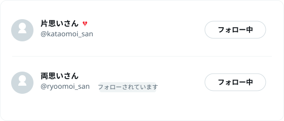

# 💔 Kataomoi — 片思いチェッカー for X

X (Twitter) で **自分はフォローしているのに、相手からはフォローされていない**「片思い」ユーザーの横に 💔 を表示する Chrome 拡張機能です。



## できること

- フォロー中 / フォロワー / 検索結果など、**ユーザー一覧が出るページすべて**で 💔 を表示
- プロフィールページの表示名の横にも 💔 を表示
- ポップアップから ON / OFF を切り替え、いま画面に出ている片思いの件数を確認

## 仕組み

判定は画面の DOM を見るだけで完結しています。API キーもログイン情報も一切不要です。

| 判定 | 見ているもの |
| --- | --- |
| 自分がフォローしている | フォローボタンの `data-testid` が `<userId>-unfollow` になっている |
| 相手がフォローしている | 「フォローされています / Follows you」バッジがある |

この 2 つが **「フォローしている」かつ「フォローされていない」** になったユーザーが片思いです。

## インストール

Chrome ウェブストアには未公開なので、いまのところ手動で読み込んでください。

1. このリポジトリを clone するか ZIP でダウンロードして展開する

   ```bash
   git clone https://github.com/daruyanagi/Kataomoi.git
   ```

2. Chrome で `chrome://extensions` を開く
3. 右上の **デベロッパー モード** をオンにする
4. **パッケージ化されていない拡張機能を読み込む** を押して、`Kataomoi` フォルダー（`manifest.json` があるところ）を選ぶ
5. [x.com のフォロー中一覧](https://x.com/home) を開く

Edge など Chromium 系のブラウザーでも同じ手順で動きます。

## 使い方

`https://x.com/<自分のID>/following` を開いてスクロールするだけです。読み込まれた行から順に 💔 が付いていきます。

> [!NOTE]
> X は表示済みの行しか DOM に持たないため、片思いの総数を一気に数えることはできません。ポップアップの件数は「いま画面に読み込まれているぶん」の数です。

## 既知の制限

- X の DOM 構造が変わると動かなくなる可能性があります（`data-testid` に依存しています）
- 鍵アカウントなど、フォロー状態のバッジが出ない相手は判定できません
- 「フォローされています」バッジの文言は主要な言語を [`src/content.js`](src/content.js) に列挙しています。未対応の言語で動かない場合は追加してください

## 開発

ビルド不要です。ファイルを編集したら `chrome://extensions` で拡張機能の再読み込みボタンを押してください。

```
manifest.json      拡張機能の定義 (Manifest V3)
src/content.js     片思い判定と 💔 の描画
src/content.css    💔 のスタイル
src/popup.html/js  ツールバーのポップアップ
icons/             アイコン
test/fixture.html  判定ロジックのテスト
```

### テスト

[`test/fixture.html`](test/fixture.html) は X のユーザー一覧を模した擬似 DOM に `src/content.js` を読み込ませ、💔 が付くべき行にだけ付いているかを検証します。ブラウザーで開くと下部に PASS / FAIL が出ます（`chrome.*` はスタブしているので拡張機能として読み込む必要はありません）。

## ライセンス

[MIT](LICENSE)
